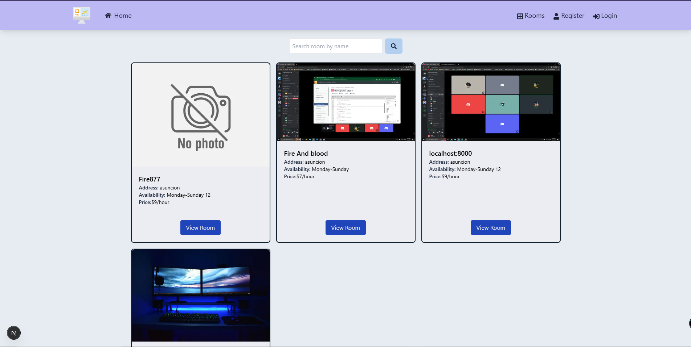
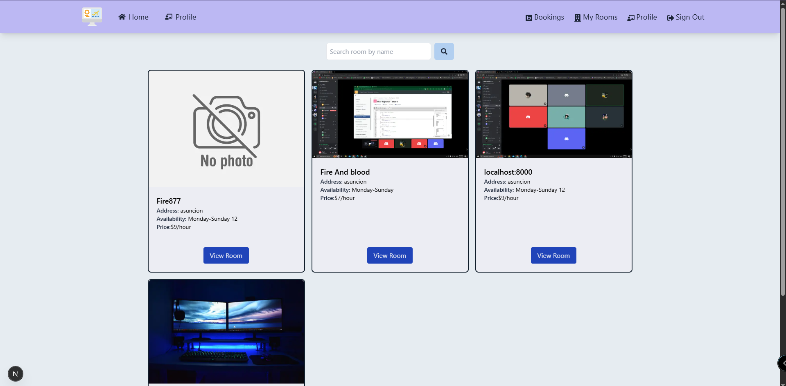
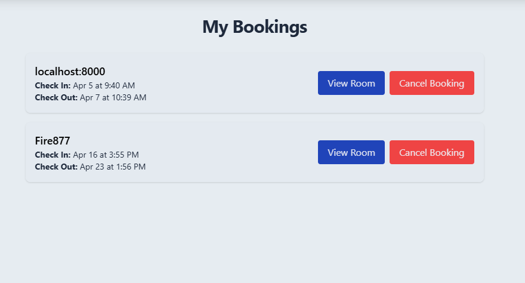
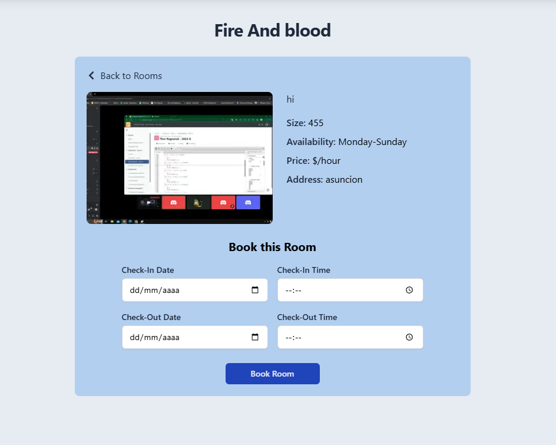

# Appwrite NextJS Booking Rooms App

This is an extension of an [Appwrite](https://appwrite.io) and [NextJS](https://nextjs.org/) project

Reference: ``https://github.com/bradtraversy/bookit-app.git``

## New Features:
- Managenent of User Roles: users now have two roles, admin (can add edit and delete the rooms and inspect users and their roles)
- User profile view: Users can view their information on the site
- Edit Room: an administrator can edit the information of the rooms
- Booking Overlaps: the system now validates that a room can not be booked in the same date and time.
- Mobile view: sidebar added for smaller screens
- Styles: added tailwind variables and classes in order to change the appearance of the site.

## Views of the App




## Setting up project

### 1. Clone the project

```bash
git clone https://github.com/FabrizioCano/BookingRooms.git
```

### 2. Choose the node package manager

- npm
- yarn
- pnpm


### 3. Install dependencies

```bash
npm install
```

### 4. Start the development server

```bash
npm run start:dev
```

### 5. Open the project

Open [http://localhost:3000](http://localhost:3000) with your browser to see the result or go to vercel where the app is deployed: [bookingRooms](https://booking-rooms-jhgqjrckg-fabrizio-canos-projects.vercel.app/)


## Setting up Appwrite

### 1. Create a project

Create a new project in Appwrite console.

### 2. Create a database

Create a new database in Appwrite console.

### 3. Create a collection

You will create 4 collections in the database
- Permissions:
    All users can create, read, update, and delete documents.

1) roles --- Fields: name (string, required)

Note: Document IDs are generated automatically.

2) user_roles --- Fields: role_id (relationship field to the roles collection, many-to-many), user_id.


3) rooms --- Fields (all are strings unless otherwise noted): user_id (required), name (required),description (required), address (required), location, availability (required), sqft, capacity, price_per_hour (required), amenities, image


4) bookings --- Fields: user_id (required), room_id (relationship to the rooms collection), check_in(required, datetime), check_out (required, datetime).

### 4.Create a storage bucket
Create a new storage bucket in the Appwrite console.
Permissions:
All authenticated users: create, read, update, delete.
Any (unauthenticated) users: read only.
Important:
Save the Bucket ID — you’ll need it for your environment variables setup.

## Configure Appwrite in the project

### 1. Create a .env.local file

Create a new file named `.env.local` in the root of the project.


### 2. Get the Appwrite project details
Go to the Appwrite console and get the following details from the project you created.

- endpoint
- project id
- database id
- collection id
- bucket id

You need to get all these fields for your env.file:
- NEXT_APPWRITE_KEY=
- NEXT_PUBLIC_APPWRITE_PROJECT=
- NEXT_PUBLIC_APPWRITE_DATABASE=
- NEXT_PUBLIC_APPWRITE_COLLECTION_ROOMS=
- NEXT_PUBLIC_APPWRITE_COLLECTION_ROLES=
- NEXT_PUBLIC_APPWRITE_COLLECTION_USER_ROLES=
- NEXT_PUBLIC_APPWRITE_BOOKINGS=
- NEXT_PUBLIC_APPWRITE_STORAGE_BUCKET_AVATARS=
- NEXT_PUBLIC_APPWRITE_STORAGE_BUCKET_ROOMS=
- NEXT_PUBLIC_URL=


### 3. User Authentication
All users will be created and managed through Appwrite Authentication (Auth service).

Users can log in with their credentials and update their password directly through the Appwrite authentication system.

Password changes can be handled by:

- Using the update password feature in the Appwrite SDK.

- Or through any custom UI you build, using Appwrite’s account.updatePassword() method.

- Note: the system preloads two users with roles of user and admin which passwords can be changed following one of the steps just mentioned.
